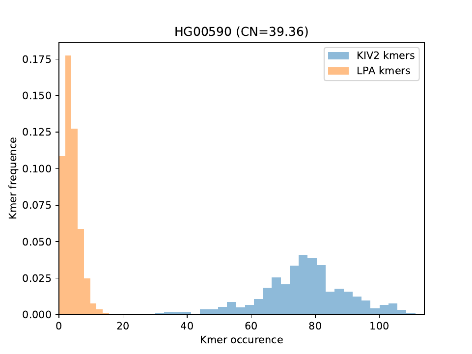

# KILDA

KILDA (KIv2 Length Determined from a kmer Analysis) provides an alignment-free estimation of the number of KIV2 (Kringle IV type 2) repeats from fastq files. 
The KIV2 copy number is estimated from the occurences of kmers specific to the KIV2 sequence, normalised by kmers from one or more normalisation region(s).

The project is composed of three main scripts:

 1. *./bin/kiv2_create_kmers_DB.nf*: nextflow script to generate the lists of kmers specific to KIV2 and the normalisation region(s)
 
 2. *./bin/kilda.nf*: nextflow script to count the occurences of the specific kmers from fastq files
 
 3. *./bin/kilda.py*: python script to estimate the number of KIV2 repeats, based on the kmer counts
 
A list of kmers is provided with this repository (so running *kiv2_create_kmers_DB.nf* is optional).


## Table of Contents

- [KILDA](#kilda)
- [Table of Contents](#table-of-contents)
- [Rationale](#rationale)
- [Dependencies](#dependencies)
- [Test Dataset](#test-dataset)
- [Examples](#examples)
- [kiv2_create_kmers_DB](#kiv2_create_kmers_DB)
   - [Workflow](#workflow)
   - [Input](#input)
   - [Output](#output)
- [kilda.nf](#kilda)
   - [Workflow](#workflow-1)
   - [Input](#input-1)
   - [Output](#output-1)
- [kilda.py](#kilda-1)
   - [Usage](#usage)
   - [Input](#input-2)
   - [Output](#output-2)


## Rationale

The KIV2 copy number is determined by comparing the mean occurence of kmers specific to the KIV2 repeats (in blue in the plot below)
against the mean occurence of kmers specific to a normalisation region (e.g. the LPA gene, yellow in the plot below):



The lists of specific kmers can be generated with the nextflow script [kiv2_create_kmers_DB](#kiv2_create_kmers_DB).

The kmers can be counted with the nextflow script [kilda.nf](#kilda).

The kiv2 copy numbers are calculated using the python script [kilda.py](#kilda-1).

The script can also take a list of SNPs with representative reference/alternative kmers, and will return
the occurences of each kmer. This can be used to assess the presence/absence of LPA-related SNPs to add context around
the KIV2 copy-number.

Example of output:

```
ID      KIV2_CN rs41272114_ref  rs41272114_alt 	quantile
HG00114 32.53   47      		0      			4
HG00111 34.64   46      		0      			6
HG00106 40.68   44      		0      			9
HG00149 38.95   41      		0      			8
HG00112 37.01   44      		0      			7
HG00109 35.12   58      		0      			6
HG00141 29.96   52      		0      			3
HG00233 26.81   27      		22     			1
HG00123 28.53   31      		0      			2
```

*ID*: the sample identifier
*KIV_CN*: the KIV2 copy number detected with KILDA
*rs41272114_ref*: the occurence of kmers representing rs41272114 reference allele
*rs41272114_alt*: the occurence of kmers representing rs41272114 alternative allele
*quantile*: which decile the sample belongs to within this group

## Dependencies

The nextflow scripts were developed and tested on Linux (Debian release 11) using nextflow 22.04.5.

You will need to have the following dependencies installed:
- **jellyfish** (tested with v2.2.10)
- **samtools** (tested with v1.19)
- **bedtools** (tested with v2.27.1)

kilda.py was developed and tested on Linux (Debian release 11) using Python 3.9.2

You will need to have the following dependencies installed:
- **Python v3 or higher**
- **The following python packages:** pandas, numpy, matplotlib, getopt, sys, os, warnings (note: the following packages should be installed by default: getopt, sys, os, warnings)


A recipe to build a singularity image containing all the dependencies is provided with this repository (*kiv2_20240530.def*).

```
sudo singularity build kiv2_20240530_0.2.sif kiv2_20240530.def
```

Alternatively, the image can be pulled from Sylabs:

```
singularity pull library://mcorentin/kilda/kiv2_20240530:0.2
```

## Test Dataset

A test dataset is available under "./test_dataset/", it can be launched with the following commands:

```
cd /path/to/kilda/

singularity pull library://mcorentin/kilda/kiv2_20240530:0.2

cd ./test_dataset/

nextflow-22.04.5-all run ../bin/kilda.nf -c kilda_counts.conf
```

The analysis should run in a few minutes, and KILDA output will be available under: *./results/kilda_kiv2_CNs/kilda_kiv2.CNs*

The file should contain the following results:
```
ID      KIV2_CN rs41272114_ref  rs41272114_alt  rs10455872_ref  rs10455872_alt  rs3798220_ref   rs3798220_alt   quantile
HG02597 40.08   3       1       6       0       7       0       7
HG00099 19.58   8       0       0       12      7       0       0
HG00126 24.22   8       0       7       1       4       4       2
NA21141 42.56   3       0       6       0       10      0       9
HG02601 27.94   9       0       5       1       6       0       4
```

## Examples

To create the kmers specific to KIV2 and the normalisation region(s):

```
nextflow-22.04.5-all run ./kilda/bin/kiv2_create_kmers_DB.nf -c kilda_from_scratch.conf
```

To count the occurences of the specific kmers:

```
nextflow-22.04.5-all run ./kilda/bin/kilda.nf -c kilda_counts.conf
```

To estimate the KIV2 copy numbers:

```
python3 ./bin/kilda.py \
    -c counts.list \
    -r ./data/lpa_three_rsids.tsv \
    -k ./data/kmers_GRCh38_LPA_k31/KIV2_hg38_kmers_6copies_specific.tsv \
    -l ./data/kmers_GRCh38_LPA_k31/LPA_hg38_kmers_1copies_specific.tsv \
    -o kiv2_kilda/ 
```


## kiv2_create_kmers_DB

Nextflow script to create the lists of kmers specific to the KIV2 and the normalisation regions (given as bed files). Alternatively, you can use the lists of kmers
available in *./data/kmers\_GRCh38\_LPA\_K31/*.

A template config file for this nextflow script is available in *./confs/kilda_from_scratch.conf*

### Workflow

   1. kmers are counted on the regions from the BED files

   2. kmers are filtered based on their occurences (6 for KIV2 and 1 for the normalisation region). An occurence of 6 was chosen for KIV2, as there are 6 KIV2 repetitions in the reference genome

   3. kmers from step 2 with a count > 0 anywhere else on the genome are discarded (as they are not specific)

   4. kmers in common between the KIV2 and normalisation region(s) are discarded

### Input

Input is handled through a config file. A template is provided in this repository ("kiv2_create_kmers_DB.conf")

You might need to change the following parameters accordingly:

    - kilda_dir: the path to kilda's directory
    - wdir: the path to the analysis working directory
    - kmer_DB_outdir: the path which will receive the list of kmers (as .tsv and .fasta files)
 
    - tools: the path to the tools used by the pipeline (corresponds to the tools' names if the singularity image is used)
 
    - kmer_size: the kmer size (needs to be large enough to represent unique sequences, default: 31)
    - genome_fasta: fasta file of the reference genome, will be use to check that the output kmers are not present elsewhere on the genome
    - genome_fai: the fasta index (fai) of the reference genome
    - norm_bed: BED file indicating the location(s) of the normalisation region(s)
    - kiv2_bed: BED file indicating the location(s) of the KIV2 region(s)
 
    - samplesheet: can be ignored for *kiv2_create_kmers_DB*
    - kiv2_kmers: can be ignored for *kiv2_create_kmers_DB*
    - norm_kmers: can be ignored for *kiv2_create_kmers_DB*
    - rsids_list: can be ignored for *kiv2_create_kmers_DB*

### Output

The script outputs the specific kmers as .tsv and .fasta files. The tsv files will be used as input for [kilda.nf](#kilda) for the kmer counts 
(the fasta files are generated for convenience). 

Four files are generated in total: one pair of .tsv and .fasta files for the KIV2 region and one pair of .tsv and .fasta files for the normalisation region(s).

The naming format is as follows: 
   - For KIV2: *<input_bed_name>_kmers_6copies_specific.{tsv, fasta}*
   - For the normalisation: *<input_bed_name>_kmers_1copies_specific.{tsv, fasta}*


## kilda

Nextflow script to generate counts of kmers from fastq files and two lists of kmers.

The lists of kmers can be generated with [kiv2_create_kmers_DB](#kiv2_create_kmers_db).

The script can also directly call *kilda.py* to estimate the KIV2 copy numbers from the kmer counts.

A template config file for this nextflow script is available in *./confs/kilda_counts.conf*

### Workflow

   1. kmers are concatenated into a single fasta file (if provided, the kmers corresponding to rsids are added at the end of the fasta file)
   
   2. kmers from the concatenated fasta file are counted for each sample using *jellyfish count*
   
   3. kmer occurences are dumped to a tsv file using *jellyfish dump* (ouput: "./counts/<sample_id>.counts")
   
   4. Optional: creation of a "sample map" linking sample IDs to their corresponding counts file (output: "counts.list")
   
   5. Optional: launching "kilda.py" to generate the kiv2 copy number estimation from the counts files.
   

### Input

Input is specified in the conf file:

    - kilda_dir: the path to kilda's directory
    - wdir: the path to the analysis working directory

    - tools: the path to the tools used by the pipeline (corresponds to the tools' names if the singularity image is used)
    
    - kmer_size: the kmer size (needs to be large enough to represent unique sequences, default: 31)
    - samplesheet: file indicating the samples and their associated fastq files (see example below)
    - kiv2_kmers: the KIV2 tsv file produced with [kiv2_create_kmers_DB](#kiv2_create_kmers_db)
    - norm_kmers: the normalisation region tsv file produced with [kiv2_create_kmers_DB](#kiv2_create_kmers_db)
    - rsids_list: optional, file listing a list of rsids of interest (see example below)

    - kmer_DB_outdir: can be ignored for *kilda.nf*
    - genome_fasta: can be ignored for *kilda.nf*
    - genome_fai: can be ignored for *kilda.nf*
    - norm_bed: can be ignored for *kilda.nf*
    - kiv2_bed: can be ignored for *kilda.nf*


#### samplesheet:

The samplesheet must have one sample per line, with the sample ID, a tabulation and the list of fastqs separated by a space:

```
HG00403 /path/to/HG00403_chr6_R1.fastq /path/to/HG00403_chr6_R2.fastq
HG00318 /path/to/HG00318_chr6_R1.fastq /path/to/HG00318_chr6_R2.fastq
HG00304 /path/to/HG00304_chr6_R1.fastq /path/to/HG00304_chr6_R2.fastq

```

### rsids:

The rsid file must have one rsid per line, with the variant ID, a tabulation, a kmer representing the reference sequence, a tabulation and a kmer representing the alternative sequence:

```
rs41272114  AACATGATAGACATACGCATTTGGATAGTAT AACATGATAGACATATGCATTTGGATAGTAT
rs10455872  TGTTCTCAGAACCCAATGTGTTTATACAGGT TGTTCTCAGAACCCAGTGTGTTTATACAGGT
rs3798220   CAGCCTAGACACTTCTATTTCCTGAACATGA CAGCCTAGACACTTCCATTTCCTGAACATGA

```


### Output

 - *.counts/*: a folder containing the counts files (one per sample).

 - *counts.list*: a tsv file listing the sample IDs and counts file present in ".counts/"
 
 - A folder with the output from kilda.py (see below)


## kilda

Python script to estimate the number of KIV2 repeats, based on the kmer occurences counted with [kilda.nf](#kilda)

This is run as part of [kilda.nf](#kilda-a), but can be launched independently.

### Usage

```
kilda.py -c [counts_list.tsv] -k [KIV2_unique_31mer_with_rc.tsv] -l [LPA_unique_31mer_with_rc.tsv] -r [lpa_rsids.tsv] -o [output_folder] -p -v

Input:
     -c/--counts          File with the list of ids and counts (generated by 'jellyfish dump') files. One id and file per line, tab_delimited (required).
     -k/--kiv             File listing the curated KIV2 kmers. (required, default = './KIV2_unique_31mer_with_rc.tsv')
     -l/--lpa             File listing the curated LPA kmers. (required, default = './LPA_unique_31mer_with_rc.tsv')
     -r/--rsids           File listing rsids of interest and their ref and alt kmers. (optionnal, tab-delimited, no header)

Output:
     -o/--output          The path to the output folder. (default = './kilda-output/')
     -p/--plot            If set, will produce a pdf plot of the kmer occurences for each sample.

Other:
     -v/--verbose         If set, will print messages to the screen about the analysis progress.
     -h/--help            Print the usage and help and exit.
     -V/--version         Print the version and exit.
```

### Input

The list of counts files (option -c) should contain two columns (tab delimited), *ID* and *path to the counts file*:
```
S1	/path/to/counts/S1.counts
S2	/path/to/counts/S2.counts
S3	/path/to/counts/S3.counts
S4	/path/to/counts/S4.counts
S5	/path/to/counts/S5.counts
```

Each counts file should contain 2 columns (tab delimited): *kmer* and *occurence*, and can be generated using "jellyfish dump".
```
k=31
sample_id="S1"

# Counting the kmers in the fastq files corresponding to the sample:
jellyfish count -t 6 -m ${k} -s 100M -C -o ./counts/${sample_id}_${k}mer <(zcat ./${sample_id}/fastqs/*.filt.fastq.gz);

# Querying the count file to extract the curated KIV2 and LPA kmers:
jellyfish dump ./counts/${sample_id}_${k}mer -c -t > .counts/${sample_id}.counts
```

The lists of kmers (options -k and -l) should be in txt format, one kmer per line. The output from [kiv2_create_kmers_DB](#kiv2_create_kmers_db) can be used for options -l and -k.

```
GAAACCATTTTTCCATGTCTC
CACTGATACAAATTGCCAATG
AAGTCTTTCAAGAGCTCAGGC
AACCATTTTTCCATGTCTCTG
ACGTAGATATAGAAACAGATC
AGGCTTCCTCCTACATGGTAG
GGAGGAAAAGAGCTCTACAAA
...
```

For the identification of rsids from the kmers (option -r), the input format is (ID reference\_kmer alternative\_kmer), tab-delimited, one rsid per line:

```
rs41272114      GATAGACATACGCATTTGGAT   GATAGACATATGCATTTGGAT
rs10455872      TCAGAACCCAATGTGTTTATA   TCAGAACCCAGTGTGTTTATA
rs3798220       TAGACACTTCTATTTCCTGAA   TAGACACTTCCATTTCCTGAA
```

### Output

The script will write "kilda_kiv2.CNs" in the output folder, containing three columns: the sample ID, the CN number and the corresponding quantile within the cohort:
```
ID      KIV2_CN quantile
HG00123 14.81   2
HG00233 12.59   1
HG00141 12.36   0
HG00109 16.01   4
HG00112 17.53   6
HG00149 14.30   2
HG00106 13.03   1
HG00111 17.83   7
HG00114 17.60   7
```

If rsids are provided with the -r option, two additional columns per rsid will be created: one with the counts for the reference kmer and one with the counts for the alternative kmer:

```
ID      KIV2_CN rs41272114_ref  rs41272114_alt 	quantile
HG00114 32.53   47      		0      			4
HG00111 34.64   46      		0      			6
HG00106 40.68   44      		0      			9
HG00149 38.95   41      		0      			8
HG00112 37.01   44      		0      			7
HG00109 35.12   58      		0      			6
HG00141 29.96   52      		0      			3
HG00233 26.81   27      		22     			1
HG00123 28.53   31      		0      			2
```

If "-p" is set when launching the script, a "plots/" folder will be created and one plot per sample, showing the distribution of the occurences of the KIV2 and LPA kmers, will be saved as a pdf file.
See Figure in [Rationale](#rationale).

If the verbose option is set (-v), then a report for each sample will be written to the terminal, indicating the number of kmers with 0 occurences, the number of unknown kmers and he mean occurences:

```
	Processing 'HG00663'
        KIV2 kmers with 0 counts: 0 / 2933
        LPA kmers with 0 counts: 2680 / 74564
        Unknown kmers: 9
        KIV2 mean kmer occurence:'73.34'
        LPA  mean kmer occurence:'4.87'
        CN = 30.10

	Processing 'HG00671'
        KIV2 kmers with 0 counts: 0 / 2933
        LPA kmers with 0 counts: 2364 / 74564
        Unknown kmers: 9
        KIV2 mean kmer occurence:'88.97'
        LPA  mean kmer occurence:'5.20'
        CN = 34.19
```

